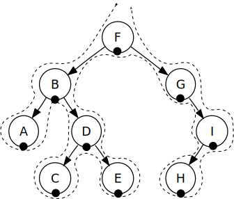
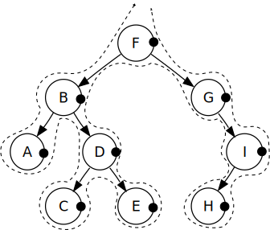

## Binary Search Tree
 * are data structures consisting of nodes which are organised in parent-child relationships, each node has at most two children.
 * each node is in sorted order - all nodes to the left of any given node must have values less than that particular node, and vice versa.
 
 
 
 * inserting nodes into a binary tree can be executed iteratively or recursively
    * starting at the root, if it does not exist, insert the node there.
    * if it does, is the value greater than or less than that of the root.
    * if it is less than, go left (if  it's greater than go right) and insert it there if a node does not exist.
    * If a node exists, compare it to the node you want to insert, is it less than or greater than and then pick left or right appropriately. If a node does not exist insert it there. If it does, again compare it to that node and repeat the process.
    * you keep going until you find a node with no left or right value and insert the new node there.
    
 * finding a node can be executed iteratively or recursively
    * starting at the root, if the value you're looking for is less that that of the root, go left - if it exists, otherwise right.
    * keep repeating the process until you find a bode with that value, or return 'undefined'.
    
 * typically search, insert and delete operations can all be performed in O(log n) time, space complexity is O(n). This is not the case if the tree is unbalanced, more nodes on one side compared ot the other - in worst case scenarios the run time can be O(n).
   

### BST Traversal
 * two algorithms are available for searching BST's which enable us to visit each node only once, each utilizes a secondary data structure in order to traverse the tree.
 
    * Depth First Search (DFS) - uses a stack, three different approaches to performing the search. the implementation of the three is very similar - once you implement one of these, you can implement the others by simply changing the order the code is executed in.
        * pre-order - start at the root node and check the value, if it has a value, record it. Recursively call the pre-order function on the sub-tree to the left of the current node. Repeat the process on the sub-tree to the right of the current node. In the image below, starting at the root would capture F, B, A, D, C, E, G, I, H
        
        
        * in-order - starting at the root node, recursively call the pre-order function on the subtree to the left of the current node. check the value of the current node, record it if it has one. Repeat the process for the subtree to the right of the current node. In the image below, starting at the root would capture A, B, C, D, E, F, G, H, I - nodes in order.
  
        
        * post-order - starting at the root node, recursively call the pre-order function on the subtree to the left of the current root, repeat the process with the subtree to the right. Check the value of the current node, record it if it has a value. Looking at the image below, using post-order would capture the values in the following order: A, C, E, D, B, H, I, G, F
  
        
    * Breadth First Search (BFS) - uses a queue and searched the tree horizontally. Starting at the root, enqueue the root node. On dequeueing the node, capture it's value, if it has a left node, enqueue it, if it has a right node, enqueue it. While there are nodes in the queue, repeat the process. Dequeue the first, capture the value, enqueue it's left and right nodes if it has any in that order. Looking at the image below, using BFS results in the following order: F, B, G, A, D, I, C, E, H
    
  
  
### BST Removal
  
    
#### Glossary
 * Root - The top node in a tree.
 * Child -A node directly connected to another node when moving away from the Root.
 * Parent - The converse notion of a child.
 * Siblings -A group of nodes with the same parent.
 * Descendant - A node reachable by repeated proceeding from parent to child.
 * Ancestor - A node reachable by repeated proceeding from child to parent.
 * Leaf - A node with no children.
 * Edge - The connection between one node and another.
 * Path -A sequence of nodes and edges connecting a node with a descendant.
 * Level - The level of a node is defined by 1 + (the number of connections between the node and the root).
 * Height of node - The height of a node is the number of edges on the longest path between that node and a descendant leaf.
 * Height of tree- The height of a tree is the height of its root node.
 * Depth - The depth of a node is the number of edges from the tree's root node to the node.
  
#### References
[Tree Traversal](https://en.wikipedia.org/wiki/Tree_traversal)  