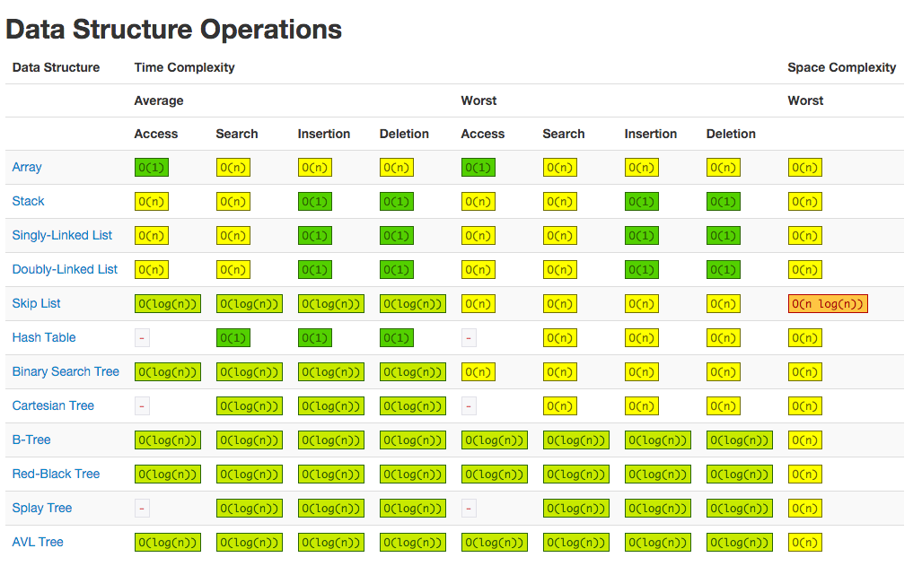

## Data Structures
 
 * in computer science a data structure is simply a way of organizing data so it can be accessed efficiently - access could mean any of the CRUD operations.
 * data structure's performance is measured based on it's space complexity (amount of memory required to hold it), and time complexity - time required to perform [access, search, insert and delete](http://bigocheatsheet.com/), e.g for an array accessing any element, no matter the size of the array is an O(1) operation, whilst insert, search and delete operations are generally O(n) operations.
 
 

## Arrays

 * most basic and frequently used data structure.
 * arrays are stored in memory contiguously, adjacent elements in an array are stored in adjacent locations in memory. Arrays store the memory address of the first element in the array. Since arrays are contiguous, accessing any other element is simply a case taking the memory address of the first and shifting the address by some amount based on the index of the element required.
 * thus ALL array access is constant time, O(1).
 * arrays, like numbers, strings, objects, etc, are stored on the heap. Since arrays are stored contiguously, when an array grows beyond the current contiguous space in memory, the javascript interpreter creates a new memory location with sufficient contiguous space and copies over every element. Thus push operations can be O(n) if we run out of contiguous memory space at the current location.
 * pop is an O(1) operation - removing an element from the end
 * shift/unshift are O(n) operations - adding/removing elements from the front of the array means that all elements that follow must be shifted either up/down by one - the operations are expensive. This is also the case for inserting/removing elements in the middle
 * adding/removing elements using splice is also O(n) for the same reason.
 * find is O(n) in the worst case where you have an unsorted array - you need to examine every element. Where you have a sorted array, if the value you're looking for is less than the current item, you can conclude the item is not in the array. Worst case you still have to examine the whole array. Also take into account sorting the array. 
 * determining the min, max and avg of arrays of numbers are also O(n) operations since you have to examine every element
 
 
### Summary

access/pop operations          - O(1)
push/shift/unshift/find        - O(n) 
space complexity               - O(n) 

### References
[Data structure overview](ttp://blog.benoitvallon.com/data-structures-in-javascript/data-structures-in-javascript/)

[Big-O Cheatsheet](http://bigocheatsheet.com/)

[Javascript Data Structures](https://github.com/loiane/javascript-datastructures-algorithms)