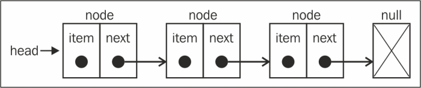

## Singly Linked Lists

 * since arrays are stored in memory contiguously, in general operations such as remove(from front), insert(either end) and search are O(n).
 * for large data sets, or where your data set is going to be changing significantly, arrays may not be the best choice.
 * in these cases linked lists offer a better solution. Although access and search are O(n) operations, insertion and deletion are O(1) - constant time (for shift/unshift operations).
 * linked lists are a sequential collection of elements, or nodes, but they are not stored sequentially/contiguously. Each node, stores the value (or reference when an object), and a pointer or reference to the memory location of the the next node in the sequence. The actual nodes of the linked list can thus be stored anywhere.
 
 
 
 * the first mode in the linked list is the 'head', by following it's pointer and each subsequent pointer you'll end up at the 'tail' or last node and end of the list.
 * shift/unshift operations are all O(1) - constant time, there is no need to shift elements up/down, unlike arrays which are O(n).
 * search/access operations are all O(n) - all we have is a reference to the head, or first element/node, finding a specific element means iterating through the list, until the required node is reached. 
 * inserting/deleting nodes anywhere other than at the head, e.g shift/unshift, are O(n) operations for the same reason as search and access operations - this include pop and push operations - where you have to traverse the whole list to reach the end.
 
### Summary

Access/search       - O(n)
Insert/delete       - O(1) - from the head, otherwise O(n) 
 
 
### References
[Singly linked list data structure](http://blog.benoitvallon.com/data-structures-in-javascript/the-singly-linked-list-data-structure/)

[Singly Linked Lists](https://www.rithmschool.com/courses/javascript-computer-science-fundamentals/singly-linked-lists)

