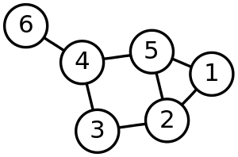

### Graphs

Similar to trees, graphs consist of nodes, or vertices, which are connected by edges. Trees are a specialised type of graph, thus all trees are graphs, but not all graphs are trees. The connection between nodes can have a weighting, or cost associating in moving from one  node to the next. Such graphs are referred to as weighted graphs, as apposed to unweighted graphs where there is no such weighting. Edges also have a direction. If it is possible to move from node A to B, but not back, i.e. unidirectional - such a graph is directed. In undirected graphs, edges a bi-directional. You can move from node A to B, and then back again. The are also acyclic graphs, you can move from node A to B, but not back again via any other route, as apposed to cyclic graphs.

Graphs have real world uses, e.g in modeling the internet as a series of interconnected nodes, a social network - an undirected graph of bi-directional relationships, navigating around a city - use a weighted graph, where the journey can be calculated based on the weightings attached to the various connections.

There are a number of approaches are used to represent a graph as a data structure:

 1. Adjacent List
 An object containing a collection of lists. Each key is the node/verticie, it's associated value being an array of edges/connections. The following example shows that node 1 is connected to nodes 2 and 5.

 
 
 ```javascript
    let adjacencyList = {
        1: [2,5],
        2: [1,3,5],
        3: [2,4,5],
        4: [3,5,6],
        5: [1,2,4],
        6: [4],
    };
```

 2. Adjacency Matrix
 A 2-D matrix showing the relationship between nodes. The matrix is made up of 0 and 1, 1 indicating that an edge connects the two nodes.
 


```text
        1   2   3   4   5   6
     1  0   1   0   0   1   0
     2  1   0   1   0   1   0
     3  0   1   0   1   0   0
     4  0   0   1   0   1   1   
     5  1   1   0   1   0   0   
     6  0   0   0   1   0   0   
```

 3. Edge List
 A 2-d array where each value is an array representing the edges. The inner array can be two values, each value representing one of the nodes in the connection. A third value can be added to represent a weighting.
 

 
```javascript
    let edgeList = [
        [4, 6],
        [4, 3],
        [4, 5],
        [3, 2],
        [5, 2],
        [5, 1],
        [2, 1]
    ];
``` 


#### Performance 

Operation           Adjacency List       Adjacency Matrix

Add Vertex              O(1)                   O(|V|2)
Add Edge                O(1)                   O(1)
Remove Vertex           O(|V|+|E|)             O(|V|2)
Remove Edge             O(|E|)                 O(1)
Query                   O(|V|+|E|)             O(1)
Storage Space           O(|V|+|E|)             O(|V|2)


#### Graph Traversal

Two algorithms used to traverse through a graph are breadth first and depth first search, we'll also assume that all the vertices/nodes are connected. Both algorithms were used to search trees, but unlike trees:
    * a graph may not have a hierarchical structure like a tree with a root node, so there may be no natural point where to begin the search. So we need to specify where the search should begin.
    * when traversing a tree you start at the root and walk down the structure, picking up nodes as you go. With graphs this is not the case, so we need to keep track of nodes so we don't visit them again.
    
Whether you use a breadth first or depth first search, the operation is the same, the only difference, breadth first uses a queue while depth first uses a stack. Breadth first outline:
    * create a queue and push the starting vertex on it.
    * mark the verticie as having been visited
    * while the queue is nonempty:
        * pop a vertex off and push it into the array of vertices to be returned
        * examine all vertices adjacent to the current vertex
        * if an adjacent vertex has not been visited yet, push it into the queue and mark it as visited
        
Neither algorithm is optimal when dealing with vertices with weights, this is the realm of 'shortest path' algorithms, e.g. Dijkstra's and A* algorithms, which take into account the weights of edges to we can find the path between two paths at the lowest cost.    